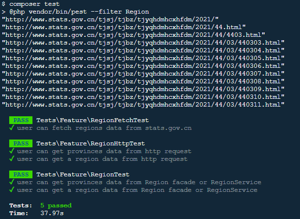

[国家统计局](http://www.stats.gov.cn/tjsj/tjbz/tjyqhdmhcxhfdm/2021/)公开的中国省市区镇行政区域结构化信息, 可广泛用于各行业的省市区镇地址信息维护.

[本组件开箱即用](https://github.com/mdphp/region), 提供了省市区镇数据的查询方法, 也提供 json 数据文件以及 sql 数据库导入文件, 方便开发者在各种场景中集成使用.

[本组件还提供了更新地区数据的方法](https://github.com/mdphp/region), 在 laravel 环境中执行 ```php artisan mdphp:fetch``` 即可拉取最新的中国省市区镇行政区域数据.

[点击查看DEMO](https://region.mdphp.cn/region)

### 安装
> 注意: 支持 laravel 6.x 以上版本
```
composer require mdphp/region
```

### 使用
```
use Mdphp\Region\Facades\Region;

$data = Region::get();

dump($data); // 31 个省份数据(不包含省份的下级地区)
```

```
use Mdphp\Region\Facades\Region;

$data = Region::find(440305);

dump($data); // 传入某地区 id，获取某地区的信息(包含该地区所有下级)
```

### HTTP 接口
```
// php artisan serve 启动本地环境后, 即可通过 http 接口访问数据

curl localhost:8000/regions

curl localhost:8000/regions/440305
```

### 更新地区数据
> 在 laravel 中更新地区数据
```
php artisan mdphp:fetch
```

> 在 package 中更新地区数据
```
compose install && composer fetch
```

### 创建 regions 数据表
```
php artisan mdphp:create-table
```

### 数据目录
> 按地区 id 命名的 json 文件中存放某地区的信息以及该地区的所有下级地区
```
src/data/*.json
```

> 31 个省份数据(不包含省份的下级地区)
```
src/data/provinces.json
```

> 所有的地区信息(包含该地区的所有下级地区)
```
src/data/regions.json
```

### 数据库文件
> 所有的地区信息(包含该地区所有下级), 可在 mysql 中导入按需使用
```
src/data/regions.sql
```

### 测试
```
compose install && composer test
```


### 联系
> 关注微信公众号 mdphp 了解更多新鲜干货
> 
> mdphp is the shortcut of modern php, it exists for deveoping php apps more efficiently and easily.


